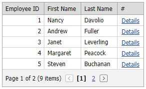

# Grid View for ASP.NET Web Forms - Show the Popup Control on the Grid's Custom Button Click

<!-- run online -->
**[[Run Online]](https://codecentral.devexpress.com/e4424/)**
<!-- run online end -->

This example demonstrates how to show the [ASPxPopupControl](https://docs.devexpress.com/AspNet/DevExpress.Web.ASPxPopupControl) when a user clicks the custom button in the grid's command column.



## Show the Popup in the Client-Side Custom Button Click Event Handler

Handle the grid's client-side [CustomButtonClick](https://docs.devexpress.com/AspNet/js-ASPxClientGridView.CustomButtonClick) event. In the handler, get the key value of the specified row and call the `OnDetailsClick` function. In this function, send a callback to the popup control with the row's key value as a parameter.

```xml
<dx:ASPxPopupControl ID="popup" ClientInstanceName="popup" runat="server" ... >
    ...
</dx:ASPxPopupControl>

<dx:ASPxGridView ID="gv" runat="server" ClientInstanceName="gv" ... >
    <Columns>
        ...
        <dx:GridViewCommandColumn VisibleIndex="4">
            <CustomButtons>
                <dx:GridViewCommandColumnCustomButton ID="btnDetails" Text="Details" />
            </CustomButtons>
        </dx:GridViewCommandColumn>
    </Columns>
    <ClientSideEvents CustomButtonClick="OnCustomButtonClick" />
</dx:ASPxGridView>
```

```js
function OnCustomButtonClick(s, e) {
    OnDetailsClick(gv.GetRowKey(e.visibleIndex))
}
function OnDetailsClick(keyValue) {
    popup.Show();
    popup.PerformCallback(keyValue);
}
```

## Show the Popup on the Custom Button Callback

Handle the grid's server-side [CustomButtonCallback](https://docs.devexpress.com/AspNet/DevExpress.Web.ASPxGridView.CustomButtonCallback) event. In the handler, get the value of the specified data cell and assign this value to the [ASPxGridView.JSProperties](https://docs.devexpress.com/AspNet/DevExpress.Web.ASPxGridBase.JSProperties) `cpKeyValue` property. Handle the popup's client-side [EndCallback](https://docs.devexpress.com/AspNet/js-ASPxClientPopupControlBase.EndCallback) event. In this handler, send a callback to the popup control with the key value as a parameter.

```xml
<dx:ASPxPopupControl ID="popup" ClientInstanceName="popup" runat="server" ...>
    ...
</dx:ASPxPopupControl>

<dx:ASPxGridView ID="gv" runat="server" ClientInstanceName="gv" KeyFieldName="EmployeeID"
    OnCustomButtonCallback="gv_CustomButtonCallback">
    <ClientSideEvents EndCallback="OnEndCallback" />
    <Columns>
        ...
        <dx:GridViewCommandColumn VisibleIndex="4">
            <CustomButtons>
                <dx:GridViewCommandColumnCustomButton ID="btnDetails" Text="Details" />
            </CustomButtons>
        </dx:GridViewCommandColumn>
    </Columns>
</dx:ASPxGridView>
```

```c#
protected void gv_CustomButtonCallback(object sender, ASPxGridViewCustomButtonCallbackEventArgs e) {
    ASPxGridView grid = (ASPxGridView)sender;
    string keyValue = grid.GetRowValues(e.VisibleIndex, "EmployeeID").ToString();
    gv.JSProperties["cpKeyValue"] = keyValue;
}
```

```js
function OnEndCallback(s, e) {
    popup.Show();
    popup.PerformCallback(gv.cpKeyValue);
}
```

## Show the Popup on the Custom Button Callback When the Grid's CallBacks are disabled

Handle the grid's server-side [CustomButtonCallback](https://docs.devexpress.com/AspNet/DevExpress.Web.ASPxGridView.CustomButtonCallback) event. In the handler, get the value of the specified data cell and save this value in the current session state. Show the popup control on the grid's postback.

```xml
<dx:ASPxPopupControl ID="popup" ClientInstanceName="popup" runat="server" ...>
    <ContentCollection>
        <dx:PopupControlContentControl ID="PopupControlContentControl1" runat="server">
            <dx:ASPxGridView ID="popupGv" runat="server" .../>
        </dx:PopupControlContentControl>
    </ContentCollection>
</dx:ASPxPopupControl>

<dx:ASPxGridView ID="gv" runat="server" ClientInstanceName="gv" KeyFieldName="EmployeeID"
    OnCustomButtonCallback="gv_CustomButtonCallback" EnableCallBacks="false">
    <Columns>
        ...
        <dx:GridViewCommandColumn VisibleIndex="4">
            <CustomButtons>
                <dx:GridViewCommandColumnCustomButton ID="btnDetails" Text="Details" />
            </CustomButtons>
        </dx:GridViewCommandColumn>
    </Columns>
</dx:ASPxGridView>
```

```c#
protected void gv_CustomButtonCallback(object sender, ASPxGridViewCustomButtonCallbackEventArgs e) {
    ASPxGridView grid = (ASPxGridView)sender;
    string keyValue = grid.GetRowValues(e.VisibleIndex, "EmployeeID").ToString();
    Session["EmployeeID"] = keyValue;
    ((ASPxGridView)PopupControlContentControl1.FindControl("popupGv")).DataBind();
    popup.ShowOnPageLoad = true;
}
```

## Documentation

- [How to show ASPxPopupControl on the ASPxGridView's CustomButton click](https://supportcenter.devexpress.com/ticket/details/ka18671/how-to-show-aspxpopupcontrol-on-the-aspxgridview-s-custombutton-click)
- [ASPxPopupControl](https://docs.devexpress.com/AspNet/DevExpress.Web.ASPxPopupControl)
- [ASPxGridView](https://docs.devexpress.com/AspNet/DevExpress.Web.ASPxGridView)
- [CustomButtonClick](https://docs.devexpress.com/AspNet/js-ASPxClientGridView.CustomButtonClick)
- [ASPxGridView.JSProperties](https://docs.devexpress.com/AspNet/DevExpress.Web.ASPxGridBase.JSProperties)

## Files to Look At

* [Default1.aspx](./CS/Default1.aspx) (VB: [Default1.aspx](./VB/Default1.aspx))
* [Default1.aspx.cs](./CS/Default1.aspx.cs) (VB: [Default1.aspx.vb](./VB/Default1.aspx.vb))
* [Default2.aspx](./CS/Default2.aspx) (VB: [Default2.aspx](./VB/Default2.aspx))
* [Default2.aspx.cs](./CS/Default2.aspx.cs) (VB: [Default2.aspx.vb](./VB/Default2.aspx.vb))
* [Default3.aspx](./CS/Default3.aspx) (VB: [Default3.aspx](./VB/Default3.aspx))
* [Default3.aspx.cs](./CS/Default3.aspx.cs) (VB: [Default3.aspx.vb](./VB/Default3.aspx.vb))
